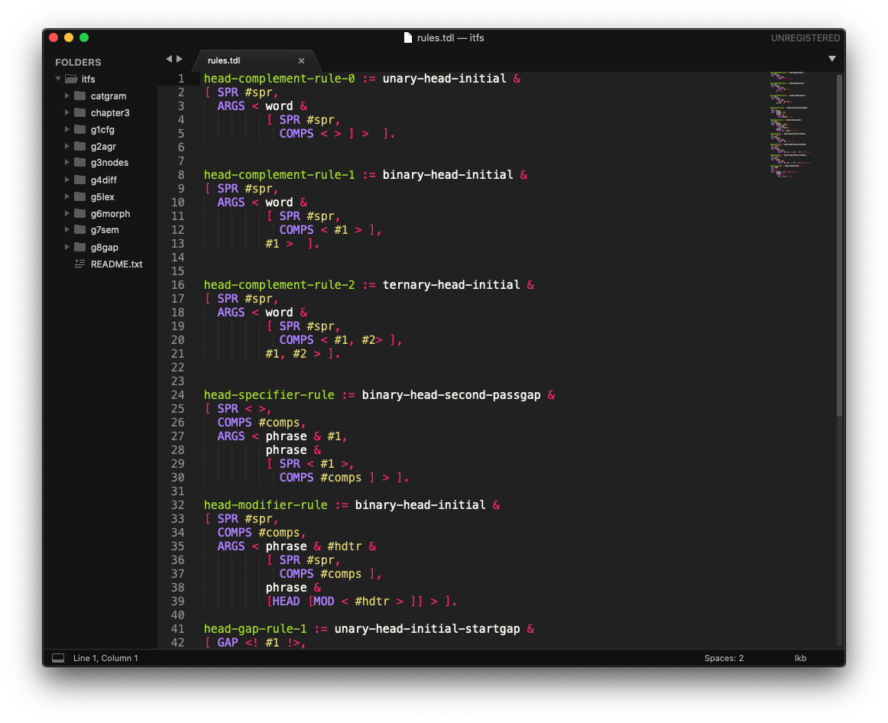

# tdl-colouring-st
Adds simple support for TDL (Type Description Language) syntax as described in Copestake 2002 to Sublime Text.

This is a syntax for [Sublime Text 3](https://www.sublimetext.com/3) which supports tdl files for the 
[Linguistic Knowledge Building](http://moin.delph-in.net/wiki/LkbTop) system. It is based on this [atom plugin](https://github.com/lemontheme/tdl-coloring)
by [lemontheme](https://github.com/lemontheme). The syntax is designed to work with the files supplied by Copestake's 2002 *Implementing Typed Feature Structures*.

## Installation

1. Download `lkb.sublime-syntax` from this repository.
2. Move it to `%appdata%\Sublime Text 3\Packages\User` (Windows) or `~/Library/Application Support/Sublime Text 3/Packages/User` (macOS).  
   If you use Linux, you'll know where to put the file.
3. Any tdl file you open should now be recognised by Sublime Text, and should in turn have pretty colours.